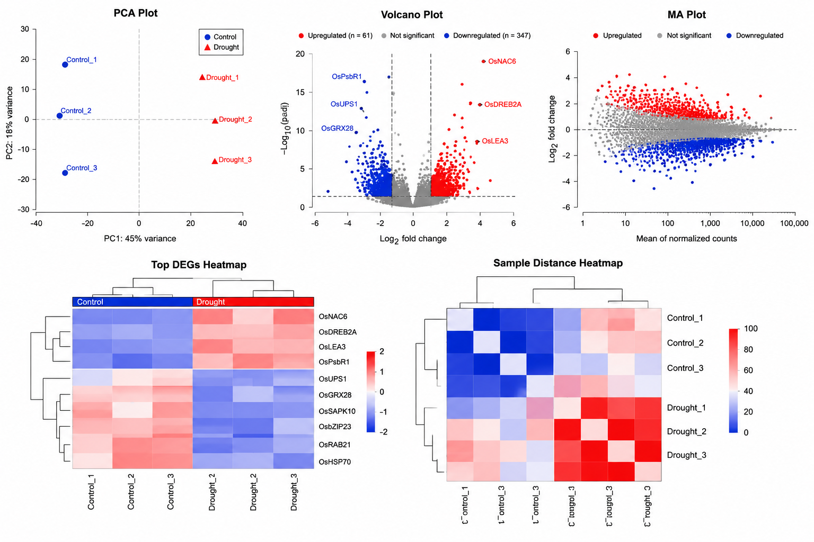

**NOTE**
The files provided in the example_output folder contain example (exemplar) values and are intended for demonstration purposes only.
They are included to illustrate the structure and format of the output files generated by this workflow and do not represent the complete analysis results.

1. DESeq2_All_Results.csv

   This is usually the largest file.
   | Gene_ID      | baseMean | log2FoldChange | lfcSE |   stat |  pvalue |    padj |
   | ------------ | -------: | -------------: | ----: | -----: | ------: | ------: |
   | Os01g0100100 |  1245.67 |           2.34 |  0.21 |  11.32 | 1.5E-15 | 2.3E-12 |
   | Os01g0100200 |    87.23 |          -1.87 |  0.45 |  -4.18 | 3.2E-05 | 0.00041 |
   | Os01g0100300 |   432.56 |           0.21 |  0.31 |   0.67 |   0.502 |   0.821 |
   | Os01g0100400 |   985.21 |          -2.71 |  0.18 | -15.02 | 2.1E-20 | 4.5E-17 |

The files DESeq2_Significant_DEGs.csv, DESeq2_Upregulated_Genes.csv, and DESeq2_Downregulated_Genes.csv follow the same format as DESeq2_All_Results.csv.
However, they contain only the significant differentially expressed genes (DEGs), only the upregulated DEGs and only the downregulated DEGs, respectively.

2. DESeq2_Normalized_Counts.csv

   This is a matrix.The rows are genes and the columns are samples.
   | Gene_ID      | Control_1 | Control_2 | Control_3 | Drought_1 | Drought_2 | Drought_3 |
   | ------------ | --------: | --------: | --------: | --------: | --------: | --------: |
   | Os01g0100205 |     23.45 |     25.12 |     22.84 |    138.92 |    141.21 |    145.62 |
   | Os01g0100210 |    321.43 |    318.77 |    330.54 |     98.66 |     91.22 |     87.54 |
   | Os01g0100250 |     12.78 |     11.42 |     13.55 |     74.31 |     76.81 |     80.12 |

3.DESeq2_Result_Summary.csv
   | Category               | Count |
   | ---------------------- | ----: |
   | Genes before filtering | 24634 |
   | Genes after filtering  | 21267 |
   | All tested genes       | 21267 |
   | Significant DEGs       |   408 |
   | Upregulated genes      |    61 |
   | Downregulated genes    |   347 |

   

